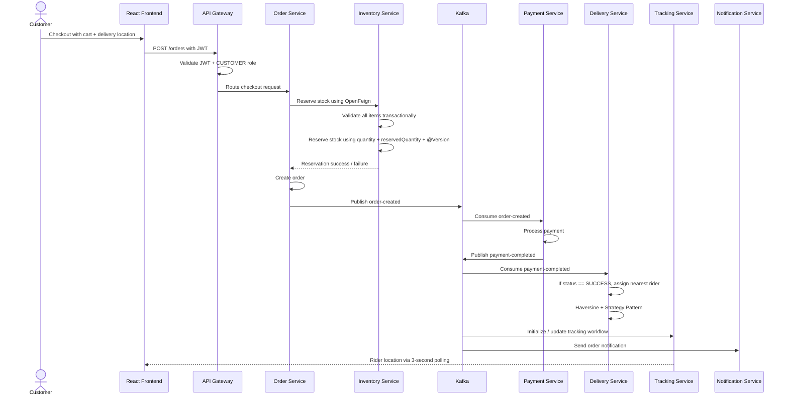
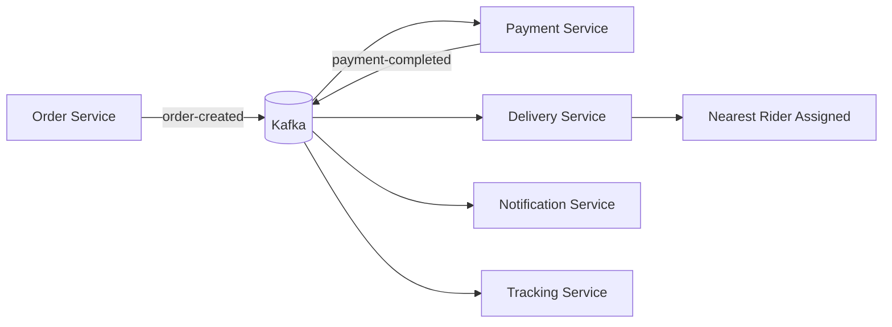

<div align="center">

# 🛒 OrderEasy — Quick-Commerce Microservices Platform

### Production-like backend system for hyperlocal grocery and essentials delivery

**Java · Spring Boot · Microservices · Kafka · MySQL · React · Spring Cloud Gateway · Eureka · OpenFeign · Resilience4j**

[](https://openjdk.org/)
[](https://spring.io/projects/spring-boot)
[](https://kafka.apache.org/)
[](https://www.mysql.com/)
[](https://react.dev/)

</div>

---

## 📌 Overview

**OrderEasy** is a production-like quick-commerce platform inspired by systems such as Blinkit, Instamart, and Zepto. The project focuses on backend architecture concepts used in real-world order management systems: microservices, API Gateway, service discovery, database-per-service, synchronous and asynchronous communication, inventory consistency, rider assignment, live tracking, and role-based access control.

The system supports the complete order journey:

```text
Customer checkout → stock reservation → order creation → payment processing → rider assignment → live tracking → notification
```

The main design goal is to show how a quick-commerce backend can maintain correctness during checkout while keeping downstream workflows decoupled and scalable.

---

## ✨ Key Highlights

- Built with **9 Spring Boot domain microservices**.
- Used **Spring Cloud Gateway** as the single entry point.
- Used **Eureka Discovery Server** for service registration and discovery.
- Followed **database-per-service** architecture using MySQL.
- Used **OpenFeign** for synchronous service-to-service communication.
- Added **Resilience4j Circuit Breaker** to protect critical downstream calls.
- Used **Kafka** for asynchronous event-driven workflows.
- Implemented **two-phase stock reservation** using `@Transactional`.
- Prevented stock overselling using **JPA Optimistic Locking** with `@Version`.
- Returned **HTTP 409 Conflict** on version mismatch / concurrent stock update conflict.
- Assigned riders using **Haversine distance calculation** and **Strategy Pattern**.
- Built live delivery tracking using **React Leaflet**, rider marker, route polyline, and 3-second polling.
- Enforced **JWT-based RBAC** for `CUSTOMER`, `ADMIN`, and `DELIVERY_PARTNER` at API Gateway level.

---

## 🧩 Microservices and Responsibilities

| Service | Responsibility | Database / Ownership |
|---|---|---|
| **Auth Service** | User registration, login, JWT generation, role management | `ordereasy_auth_db` |
| **Product Service** | Product catalog, product details, product listing | `ordereasy_product_db` |
| **Cart Service** | Customer cart management and cart item operations | `ordereasy_cart_db` |
| **Inventory Service** | Stock quantity, reserved quantity, optimistic locking, stock release | `ordereasy_inventory_db` |
| **Order Service** | Checkout orchestration, order creation, order status, Kafka event publishing | `ordereasy_order_db` |
| **Payment Service** | Simulated payment processing, idempotent payment creation, `payment-completed` event | `ordereasy_payment_db` |
| **Delivery Service** | Rider assignment, partner availability, Haversine-based nearest rider selection | `ordereasy_delivery_db` |
| **Tracking Service** | Rider GPS updates, latest location, route history | `ordereasy_tracking_db` |
| **Notification Service** | Order and status notifications through async events | `ordereasy_notification_db` |

### Supporting Infrastructure

| Component | Purpose |
|---|---|
| **Spring Cloud Gateway** | Single entry point, route mapping, JWT validation, RBAC enforcement |
| **Eureka Discovery Server** | Service registration and discovery |
| **Apache Kafka** | Event bus for asynchronous workflows |
| **MySQL** | Separate database per service |

---

## 🔁 End-to-End Order Flow



### Corrected Delivery Workflow

Delivery assignment happens **after payment succeeds**, not directly after order creation.

```text
order-created → Payment Service → payment-completed → Delivery Service → rider assignment
```

This avoids assigning riders for unpaid or failed orders.

---

## 🔌 Communication Pattern

| Communication | Used For | Why |
|---|---|---|
| **REST via Gateway** | Frontend access to backend services | Single entry point, centralized auth, cleaner routing |
| **OpenFeign** | Order Service → Inventory Service | Checkout needs immediate stock success/failure response |
| **Kafka** | Payment, delivery, tracking, notification workflows | Decouples downstream services from checkout thread |
| **Eureka** | Service discovery | Services can call each other by service name instead of hardcoded host/port |
| **Resilience4j Circuit Breaker** | Critical Feign calls | Prevents cascading failure when downstream service is unavailable |

### Why synchronous call for inventory?

Stock reservation is part of the critical checkout path. The customer should not receive order confirmation unless inventory is actually available and reserved. Therefore, Order Service calls Inventory Service synchronously using OpenFeign.

### Why Kafka for payment and delivery?

Payment, delivery assignment, tracking, and notifications are downstream workflows. They can be handled asynchronously after the order is created, which keeps the checkout flow cleaner and reduces tight coupling between services.

---

## 📦 Stock Reservation and Overselling Prevention

Inventory Service maintains two important values:

```text
quantity          → total physical stock
reservedQuantity  → quantity temporarily reserved during order processing
```

During checkout, Inventory Service follows a two-phase reservation approach:

```text
Phase 1: Validate all requested items
Phase 2: Reserve all items only if every item is available
```

The reservation method is transactional:

```text
If any item is unavailable → transaction fails → no partial reservation
If all items are available → reservedQuantity increases for all items
```

### Optimistic Locking

The `Stock` entity uses JPA `@Version`.

```java
@Version
private Long version;
```

If two customers try to reserve the last unit of the same product at the same time:

```text
Both transactions read the same stock row
First transaction commits successfully and increments version
Second transaction tries to commit with old version
JPA detects version mismatch
Second request fails with conflict
Stock never goes negative
```

The API returns **HTTP 409 Conflict** when a concurrent stock update conflict occurs.

---

## 💳 Payment and Delivery Workflow

The order-payment-delivery flow is event-driven:

```text
1. Order Service reserves stock.
2. Order Service creates order.
3. Order Service publishes order-created event.
4. Payment Service consumes order-created.
5. Payment Service processes payment.
6. Payment Service publishes payment-completed event.
7. Delivery Service consumes payment-completed.
8. Delivery Service assigns a rider only if payment status is SUCCESS.
```

This design ensures that riders are not assigned for unpaid or failed orders.

### Kafka Event Flow



Kafka is treated as **at-least-once delivery**, so consumers use idempotency checks where needed, such as checking by `orderId` before creating duplicate payment or delivery records.

---

## 🛵 Rider Assignment Design

Delivery Service assigns riders based on customer delivery coordinates and available delivery partner coordinates.

### Haversine Formula

The Haversine formula is used because latitude and longitude are spherical coordinates, not flat Cartesian points.

```text
Customer location + rider location → distance in kilometers
```

The current strategy selects the nearest available rider in Bangalore.

### Strategy Pattern

Rider assignment is implemented using the Strategy Pattern.

```text
DeliveryAssignmentStrategy
        ↓
NearestPartnerStrategy
        ↓
Haversine-based nearest rider selection
```

This follows the **Open/Closed Principle**:

```text
Add a new assignment strategy without modifying the core delivery assignment flow.
```

Examples of future strategies:

- nearest rider
- least-loaded rider
- zone-based rider
- priority rider assignment
- batching-based assignment

---

## 🗺️ Live Tracking

Live tracking is implemented using the Tracking Service and React Leaflet.

### Tracking Flow

```text
Delivery Partner updates location
        ↓
Tracking Service stores latest coordinates
        ↓
Customer frontend polls every 3 seconds
        ↓
React Leaflet updates rider marker and route polyline
```

### Why polling instead of WebSocket?

Polling is simpler and sufficient for this project because updates every 3 seconds are acceptable for a quick-commerce tracking flow.

For a production-scale system, WebSocket or Server-Sent Events would reduce unnecessary repeated requests and provide lower-latency updates.

---

## 🔐 Security and RBAC

Authentication and authorization are centralized at the API Gateway.

```text
Client request → API Gateway → JWT validation → role check → route to service
```

### Roles

| Role | Access |
|---|---|
| **CUSTOMER** | Browse products, manage cart, place orders, view own orders, track delivery |
| **ADMIN** | Manage inventory, orders, riders, analytics |
| **DELIVERY_PARTNER** | View assigned deliveries, update delivery status, update location |

### Why validate JWT at Gateway?

Gateway-level validation avoids duplicating authentication logic in every service and ensures unauthorized requests are blocked before reaching internal services.

---

## 🛡️ Resilience and Failure Handling

| Failure Case | Handling |
|---|---|
| Inventory Service unavailable | Resilience4j Circuit Breaker prevents repeated failing calls |
| Concurrent stock reservation | `@Version` optimistic locking detects conflict |
| One item unavailable in cart | Transaction rolls back, no partial stock reservation |
| Duplicate Kafka event | Consumers use `orderId`-based idempotency where applicable |
| Payment not successful | Delivery Service skips rider assignment unless status is `SUCCESS` |
| Tracking update delay | Frontend continues polling and updates when latest location is available |

> Kafka is not treated as exactly-once. The project assumes at-least-once delivery and handles duplicate events at the consumer level where required.

---

## 🧠 Design Patterns and System Design Concepts

| Concept / Pattern | Where Used | Why |
|---|---|---|
| **Microservices Architecture** | 9 domain services | Independent ownership and separation of responsibilities |
| **Database-per-service** | Separate MySQL DB per service | Loose coupling and independent data ownership |
| **API Gateway Pattern** | Spring Cloud Gateway | Single entry point, routing, JWT validation, RBAC |
| **Service Discovery** | Eureka | Dynamic service lookup without hardcoded URLs |
| **Event-Driven Architecture** | Kafka workflows | Decouple payment, delivery, notification, and tracking |
| **Circuit Breaker** | Resilience4j with Feign | Prevent cascading failures |
| **Strategy Pattern** | Rider assignment | Add new assignment algorithms easily |
| **Optimistic Locking** | Inventory stock update | Prevent overselling without pessimistic locks |
| **Transactional Boundary** | Bulk stock reservation | Prevent partial updates |
| **Idempotency** | Payment/delivery consumers | Handle duplicate Kafka messages safely |

---

## 🧰 Tech Stack

### Backend

| Technology | Purpose |
|---|---|
| Java | Backend programming language |
| Spring Boot | Microservice development |
| Spring Cloud Gateway | API Gateway and request routing |
| Eureka Discovery Server | Service discovery |
| Spring Cloud OpenFeign | Synchronous inter-service calls |
| Resilience4j | Circuit Breaker and fault tolerance |
| Apache Kafka | Event-driven communication |
| Spring Data JPA / Hibernate | ORM and database access |
| MySQL | Relational persistence |
| JWT | Stateless authentication |
| Maven | Build management |

### Frontend

| Technology | Purpose |
|---|---|
| React.js | Frontend UI |
| Vite | Frontend build tool |
| Axios | HTTP communication |
| React Router | Client-side routing |
| Leaflet / React Leaflet | Live map tracking |
| Tailwind CSS | Styling |
| Recharts | Admin analytics charts |

---

## 🗂️ Project Structure

```text
order-easy-main/
├── backend/
│   ├── api-gateway/               # Gateway routing + JWT/RBAC
│   ├── auth-service/              # Auth, JWT, roles
│   ├── product-service/           # Product catalog
│   ├── cart-service/              # Cart management
│   ├── inventory-service/         # Stock reservation + optimistic locking
│   ├── order-service/             # Checkout orchestration + order events
│   ├── payment-service/           # Payment processing + payment events
│   ├── delivery-service/          # Rider assignment + Haversine strategy
│   ├── tracking-service/          # GPS tracking
│   ├── notification-service/      # Async notifications
│   └── discovery-server/          # Eureka server
├── frontend/                      # React frontend
├── infrastructure/
│   └── kafka/                     # Kafka + Zookeeper docker-compose
├── docs/                          # Architecture and design documentation
├── seed_inventory.sql
├── seed_partners.sql
├── start-all.sh
├── stop-all.sh
└── status-check.sh
```

---

## 🚀 How to Run

### Prerequisites

- Java 21+
- Maven
- MySQL 8+
- Docker and Docker Compose
- Node.js 18+

### 1. Clone the Repository

```bash
git clone https://github.com/vivekvj18/ordereasy.git
cd ordereasy
```

### 2. Configure Environment Variables

Create a `.env` file in the project root.

```env
JWT_SECRET=replace_with_your_jwt_secret
DB_USERNAME=your_mysql_username
DB_PASSWORD=your_mysql_password
TWILIO_ACCOUNT_SID=your_twilio_account_sid
TWILIO_AUTH_TOKEN=your_twilio_auth_token
TWILIO_VERIFY_SERVICE_SID=your_twilio_verify_service_sid
```

Do not commit real secrets.

### 3. Create Databases

```sql
CREATE DATABASE ordereasy_auth_db;
CREATE DATABASE ordereasy_product_db;
CREATE DATABASE ordereasy_cart_db;
CREATE DATABASE ordereasy_inventory_db;
CREATE DATABASE ordereasy_order_db;
CREATE DATABASE ordereasy_payment_db;
CREATE DATABASE ordereasy_delivery_db;
CREATE DATABASE ordereasy_tracking_db;
CREATE DATABASE ordereasy_notification_db;
```

### 4. Start Kafka

```bash
cd infrastructure/kafka
docker-compose up -d
```

### 5. Start Backend Services

You can use the startup script:

```bash
./start-all.sh
```

Or start services manually in this order:

```text
1. discovery-server
2. api-gateway
3. auth-service
4. product-service
5. cart-service
6. inventory-service
7. order-service
8. payment-service
9. delivery-service
10. tracking-service
11. notification-service
```

### 6. Start Frontend

```bash
cd frontend
npm install
npm run dev
```

### 7. Check Service Status

```bash
./status-check.sh
```

---

## 📡 Important Workflow APIs

> This README focuses on the core service workflows. The list below contains the most important workflow APIs only.

| Service | Endpoint | Purpose |
|---|---|---|
| Auth Service | `POST /auth/signup` | Register user |
| Auth Service | `POST /auth/login` | Login and receive JWT |
| Product Service | `GET /products` | Browse products |
| Cart Service | `POST /cart/items` | Add item to cart |
| Order Service | `POST /orders` | Place order / checkout |
| Inventory Service | `POST /stock/reserve-bulk` | Internal bulk stock reservation |
| Payment Service | `GET /payments/order/{orderId}` | Get payment by order |
| Delivery Service | `GET /deliveries/{orderId}` | Get assigned delivery |
| Tracking Service | `GET /tracking/{orderId}` | Get latest rider location |
| Tracking Service | `POST /tracking/update` | Delivery partner location update |

---

## 📊 Admin and Frontend Features

| Role | Features |
|---|---|
| Customer | Browse products, cart, checkout, order history, order details, live tracking |
| Admin | Order management, inventory view, delivery partner management, analytics dashboard |
| Delivery Partner | Assigned deliveries, availability update, delivery status update, location update |

Frontend live tracking includes:

- customer delivery location
- rider marker
- route polyline
- auto-refresh every 3 seconds

---

## 🧭 Architectural Decisions

| Area | Decision | Rationale |
|---|---|---|
| Service architecture | Domain-aligned microservices | Auth, catalog, cart, inventory, order, payment, delivery, tracking, and notification are separated for independent ownership and scalability. |
| Data ownership | Database-per-service | Each service owns its schema and data model, reducing tight coupling between services. |
| Critical checkout dependency | Synchronous Inventory call using OpenFeign | Stock reservation must return an immediate success or failure response before confirming an order. |
| Downstream workflows | Kafka-based asynchronous processing | Payment, delivery, tracking, and notifications are decoupled from the checkout request lifecycle. |
| Inventory concurrency | Optimistic locking with `@Version` | Prevents overselling while avoiding long-held database locks during normal checkout traffic. |
| Delivery assignment | Haversine + Strategy Pattern | Enables location-based rider selection and allows new assignment strategies to be added with minimal changes. |
| Live tracking | 3-second polling | Keeps the tracking implementation simple while still providing near-real-time location updates. |
| Security boundary | Gateway-level JWT/RBAC | Centralizes authentication and authorization before requests reach internal services. |

---

## 🔮 Future Improvements

- Integrate a real payment gateway such as Razorpay or Stripe.
- Add WebSocket or Server-Sent Events for live tracking.
- Add distributed tracing using correlation IDs.
- Add centralized logging and observability dashboards.
- Add full Docker Compose setup for all services.
- Add Redis caching for product catalog and rider-location reads.
- Add more integration tests for checkout, stock reservation, and Kafka workflows.
- Add dead-letter topics for failed Kafka event processing.

---

## 👤 Author

**Vivek Joshi**  
M.Tech CSE, International Institute of Information Technology Bangalore

- LinkedIn: `linkedin.com/in/vivekjoshi18/`
- GitHub: `github.com/vivekvj18`

---

<div align="center">

**OrderEasy** — A quick-commerce backend project focused on real-world backend architecture and engineering decisions.

</div>
